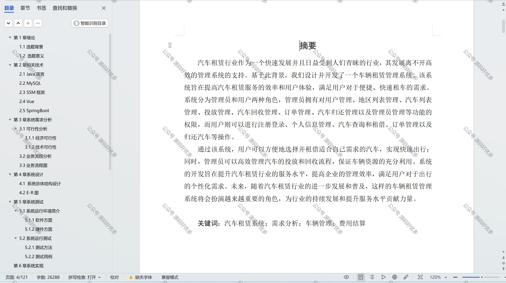

 
## 查看主页获取源码

> **作者介绍**： **✌**全网粉丝10W+本平台特邀作者、博客专家、CSDN新星计划导师、java领域优质创作者,博客之星、掘金/华为云/阿里云/InfoQ等平台优质作者、专注于项目实战 **✌**

  

### 一、作品包含

源码+数据库+设计文档万字+全套环境和工具资源+部署教程

### 二、项目技术

前端技术：Html、Css、Js、Vue、Element-ui

数据库：MySQL

后端技术：Java、Spring Boot、MyBatis

  

### 三、运行环境

开发工具：IDEA/eclipse

数据库：MySQL8.0

数据库管理工具：Navicat10以上版本

环境配置软件： JDK1.8+Maven3.6.3

前端Nodejs：16

  

### 四、项目介绍
项目编号：springbootA026

汽车租赁行业作为一个快速发展并且日益受到人们青睐的行业，其发展离不开高效的管理系统的支持。基于此背景，我们设计并开发了一个车辆租赁管理系统。该系统旨在提高汽车租赁服务的效率和用户体验，满足用户对于便捷、快速租车的需求。系统分为管理员和用户两种角色，管理员拥有对用户管理、地区列表管理、汽车列表管理、投放管理、汽车回收管理、订单管理、汽车归还管理以及管理员管理等功能的权限，而用户则可以进行注册登录、个人信息管理、汽车查询和租借、订单管理以及归还汽车等操作

### 五、运行截图

  
